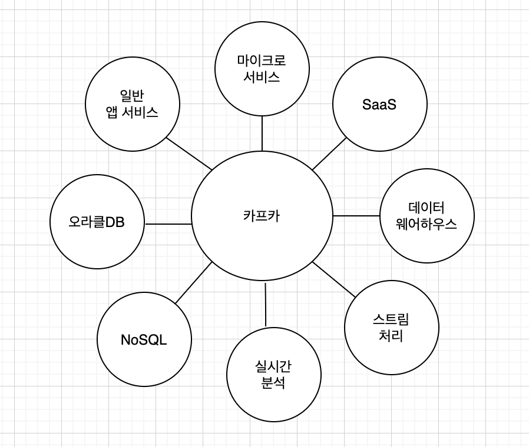
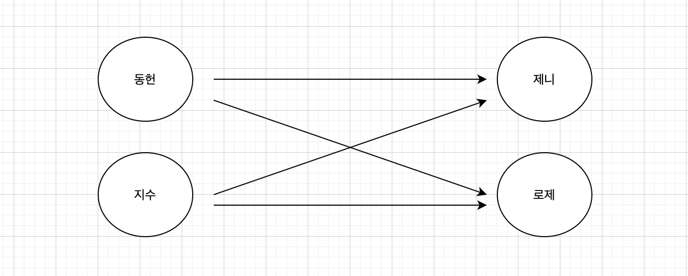
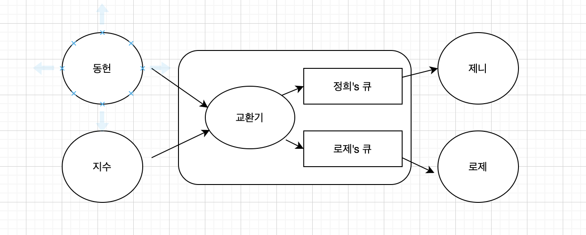

# kafka-workspace  

## 카프카의 철학
  

- 카프카의 지향점:  
  카프카를 메시지 전달의 중앙 플랫폼으로 두고 기업에서 필요한 모든 데이터 시스템뿐만 아니라,  
  마이크로서비스, SaaS 서비스까지(기타 등등) 모두 하나로 연결된 파이프라인을 만드는 것.

## 카프카의 동작 방식
- 기존의 네트워크 통신  
      
  - 빠른 전송 속도  
  - 특정 개체에 장애가 발생한 경우, 메세지를 보내는 쪽에서 대기 처리 등을 개별적으로 해주지 않으면 장애 발생할 수도 있다.  
  - 통신에 참여하는 개체가 많아질수록 확장성이 좋지 않다.  
  
  
- pub/sub 네트워크 통신 (카프카의 통신 방법)  
    
  - 개체에 장애가 발생해도 메시징 시스템만 살아있으면 메시지가 유실되지 않는다.
  - 확장성 용이.
  - 속도는 기존 네트워크 통신보다 느리다.
  
## 카프카의 특징
- 프로듀서와 컨슈머의 분리
  - 보내는 역할(프로듀서)과 받는 역할(컨슈머)를 완벽하게 분리.
  - 이후 서버가 추가되더라도 카프카로만 보내면 되기 때문에, 확장성 향상
- 멀티 프로듀서, 멀티 컨슈머
  - 하나의 프로듀서는 여러 토픽으로 메세지를 전송할 수 있으며,  
    하나의 컨슈머는 여러 토픽에서 메세지를 받아올 수 있다. 
- 디스크에 메세지 저장
  - 기존 메세징 시스템은 컨슈머가 메세지를 읽으면 큐에서 삭제했다. 
  하지만 카프카는 컨슈머가 메세지를 읽더라도 정해져 있는 보관 주기 동안 디스크에 메세지를 저장해 둔다.
- 확장성
- 고성능
## Record Key 
- 역할 : 메세지를 구분하는 역할
- 키가 동일하면 동일 파티션에 적재 -> 순서를 보장하므로 상태머신으로 사용 가능
- 역할에 따른 컨슈머 할당 적용 가능
  - ex) key : 주문 -> 주문을 처리하는 애플리케이션   
  - ex) key : 결제 -> 결제를 처리하는 애플리케이션
## Producer Acks
- ack 0 
  - 전송 속도 가장 빠름. 데이터 유실 가능성 있음.
  - 데이터 전송 즉시 성공으로 간주.
  - 리더 파티션 및 팔로워 파티션에 저장되었는 지 알 수 없음.
  - 속도가 중요하고 데이터 유실되어도 괜찮은 데이터에 사용.
- ack 1 (default)
  - 속도 보통. 데이터 유실 가능성 있음.  
  - 리더 파티션에 저장되어 있는지 확인. (팔로워 파티션은 알 수 없음)
- ack all or -1  
  - 속도 가장 느림. 메세지 전달 손실 가능성 없음.
  - 데이터가 리더, 팔로워 파티션에 모두 저장되었는지 확인. 
